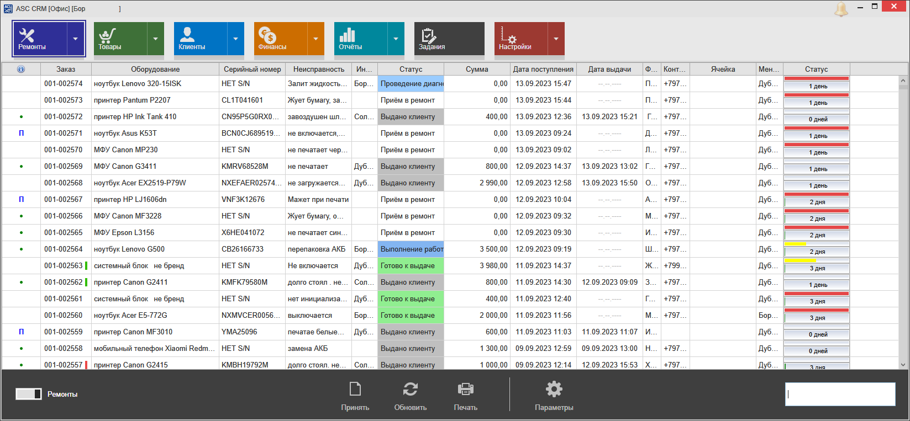
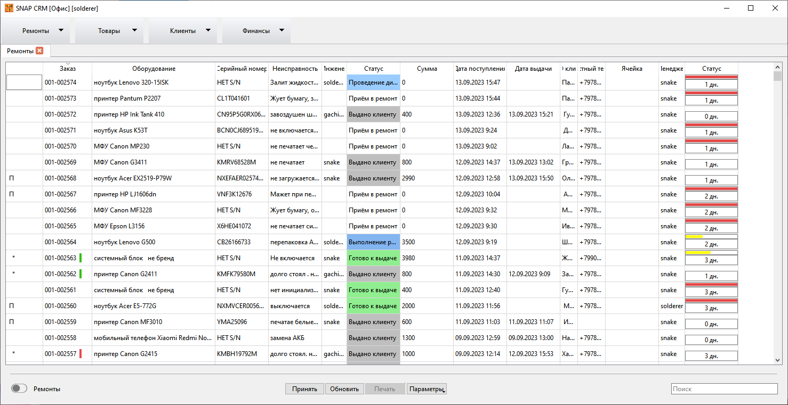

##### **RU**

SNAP CRM предназначена для сервисных центров по ремонту 
техники. Программа сделана по образу и подобию АСЦ CRM: элементы 
интерфейса в 95% расположены идентично и даже используется та же база 
данных. Причина такого решения чисто утилитарная: поскольку в какой-то 
момент ПО от АСЦ перестало развиваться, а наличие ошибок и моё 
собственное виденье некоторых вещей не давали покоя, было принято 
решение о создании своей версии. И так как реализовать подобный проект 
быстро и в одно лицо невозможно, а работать нужно, предполагается 
**одновременное** использование обеих программ. На первых этапах реализуются
 те функции, которые востребованы лично мной и/или отключены в 
дэмо-версии ПО от ноутбук1. Конечно, новые более удобные функции требуют
 доработок БД, но они вносятся очень аккуратно, так чтобы не нарушить 
работу оригинальной программы.

Также этот проект — давнее желание начать программировать что-то более серьёзное, чем скрипты CLI.

Проект изначально планировался open source, но публикация должна была состояться гораздо позже, когда будет реализовано большинство функционала АСЦ CRM (достаточного для работы только в этой программе).
Но в связи с событиями Сентября 2023 в сфере ремонта и потенциальным наличием желающих создать новую систему, было принято решение о ранней публикации.

Программа распространяется КАК ЕСТЬ. Никаких гарантий сохранения работоспособности оригинальной базы нет. Программа используется в моей мастерской повседневно, поэтому критических сбоев быть не должно, но лучше делайте резервные копии!

Зависимости:

- библиотеки редактора/генератора отчетов **LimeReport**. Вначале нужно скомпилировать его. Смотри https://github.com/solderercb/LimeReport/tree/mod (содержит доработки);

- библиотека **mysql**;

- плагин **qsqlmysql.dll** (не поставляется из коробки Qt и должен быть скомпилирован самостоятельно);

- пакеты библиотек Visual C++ Redistributable начиная с 2013.

Готовые к употреблению файлики: [Releases](https://github.com/solderercb/snap_crm/releases).

Инструкция по сборке в файле [Build_guide_for_dummies.txt](https://github.com/solderercb/snap_crm/blob/master/Build_guide_for_dummies.txt).

**Pull request приветствуется. Конструктивная критика, ошибки и предложения** могут быть высказаны [здесь](https://github.com/solderercb/snap_crm/issues) или в группе https://t.me/snap_crm

##### **Screenshots**

##### **EN**

SNAP CRM is intended for repair service centers. The 
program is made in the image and likeness of ASC CRM: 95% of the 
interface elements are located identically and even the same database is
 used. The reason for this decision is purely utilitarian: since at some
 point the software from the ASC stopped developing, and the presence of
 errors and my own vision of some things did not give rest, it was 
decided to create my own version. And since it is impossible to 
implement such a project quickly and by one person, and business process
 are very dependent from this software, it is assumed that both programs
 will be used **in same time**. At the first stages, those functions are 
implemented that are personally demanded by me and/or disabled in the 
demo version of the software from the ноутбук1. Of course, new more 
convenient functions require database modifications, but they made 
very carefully so not to disrupt the operation of the original program.

Also, this project is a long-standing desire to start programming something more complicated than CLI-scripts.

The program is distributed AS IS. There are no warrantees of the original database's functionality. The program is used in my workshop every day, so there shouldn't be any critical issues, but it's better to make backups!

Dependencies: 

- **LimeReport** editor/report generator library. You must compile it before the main. See https://github.com/solderercb/LimeReport/tree/mod (I made some changes);

- **mysql** library;

- **qsqlmysql** plugin (not distributed with Qt and must be compiled by yourself);

- Visual C++ Redistributable packages 2013 and newer.

Precompiled files: [Releases](https://github.com/solderercb/snap_crm/releases).

Build instructions in the [Build_guide_for_dummies.txt](https://github.com/solderercb/snap_crm/blob/master/Build_guide_for_dummies.txt).

**Pull request is welcome. Constructive criticism, issues and suggestions** can be expressed [here](https://github.com/solderercb/snap_crm/issues) or in [Telegram group](https://t.me/snap_crm), but keep in mind: **S**olderer is **N**ot **A** **P**rogrammer 😁
