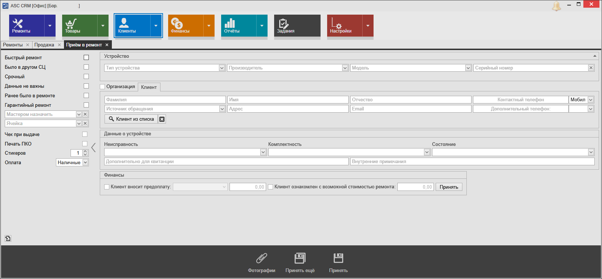
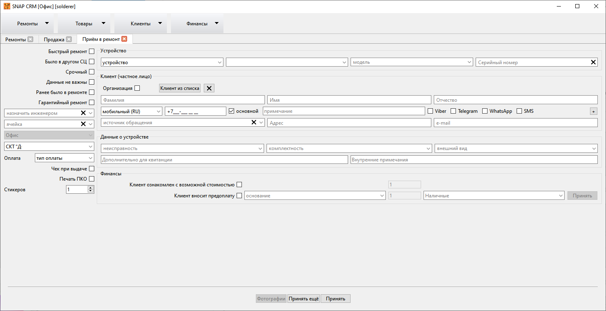
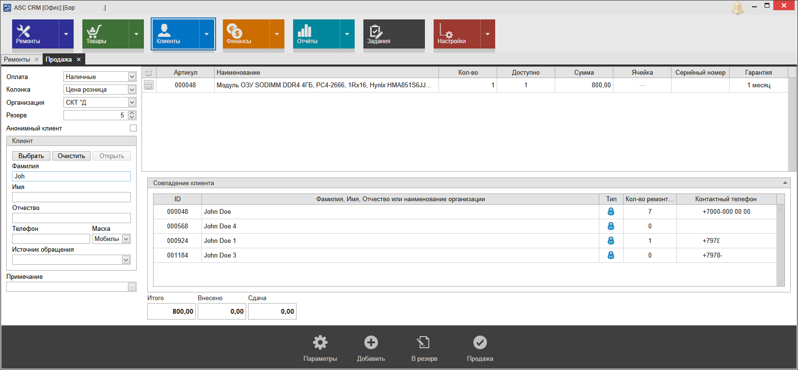
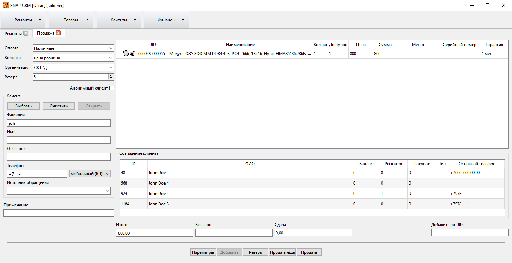

##### **RU**

SNAP CRM предназначена для сервисных центров по ремонту 
техники. Программа сделана по образу и подобию АСЦ CRM: элементы 
интерфейса в 95% расположены идентично и даже используется та же база 
данных. Причина такого решения чисто утилитарная: поскольку в какой-то 
момент ПО от АСЦ перестало развиваться, а наличие ошибок и моё 
собственное виденье некоторых вещей не давали покоя, было принято 
решение о создании своей версии. И так как реализовать подобный проект 
быстро и в одно лицо невозможно, а работать нужно, предполагается 
одновременное использование обеих программ. На первых этапах реализуются
 те функции, которые востребованы лично мной и/или отключены в 
дэмо-версии ПО от ноутбук1. Конечно, новые более удобные функции требуют
 доработок БД, но они вносятся очень аккуратно, так чтобы не нарушить 
работу оригинальной программы.

Также этот проект — давнее желание начать программировать что-то более серьёзное, чем скрипты CLI.

Проект изначально планировался open source, но публикация должна была состояться гораздо позже, когда будет реализовано большинство функционала АСЦ CRM (достаточного для работы только в этой программе).
Но в связи с событиями Сентября 2023 в сфере ремонта и потенциальным наличием желающих создать новую систему, было принято решение о ранней публикации.

Программа распространяется КАК ЕСТЬ. Никаких гарантий сохранения работоспособности оригинальной базы нет (в процессе разработки несколько раз проверялся первый запуск на "чистой" базе, но лучше делайте резервные копии!).

Изначально использовалась VCS Mercurial. При переезде на Git были выпилены субрепозитории и произведен rebase, поэтому вполне вероятно, что проект не соребётся из коробки. Исправлю позже.

Для работы нужны библиотеки редактора/генератора отчетов **LimeReport**. Вначале нужно скомпилировать его. Соответствующий проект смотри в моих репозиториях; он также содержит доработки (ветка mod).

Для работы нужна библиотека **mysql** и плагин **qsqlmysql.dll** (не поставляется из коробки Qt и должен быть скомпилирован самостоятельно).

Может еще что-то нужно... Инструкция по сборке в файле Build_guide_for_dummies.txt.

**Pull request и конструктивная критика приветствуется.**

##### **Screenshots**

##### **EN**

SNAP CRM is intended for repair service centers. The 
program is made in the image and likeness of ASC CRM: 95% of the 
interface elements are located identically and even the same database is
 used. The reason for this decision is purely utilitarian: since at some
 point the software from the ASC stopped developing, and the presence of
 errors and my own vision of some things did not give rest, it was 
decided to create my own version. And since it is impossible to 
implement such a project quickly and by one person, and business process
 are very dependent from this software, it is assumed that both programs
 will be used simultaneously. At the first stages, those functions are 
implemented that are personally demanded by me and/or disabled in the 
demo version of the software from the ноутбук1. Of course, new more 
convenient functions require database modifications, but they are maden 
very carefully so not to disrupt the operation of the original program.

Also, this project is a long-standing desire to start programming something more serious than CLI-scripts.

Pull request and constructive criticism is welcome, but remember: **S**olderer is **N**ot **A** **P**rogrammer 😁
