# Менеджер закупок

Менеджер предназначен для организации процесса заказа запчастей. Вкладка разделена на три условных области.

- левая часть отвечает за фильтрацию и группировку заявок;

- в верхней части отображаются заявки, созданные пользователями;

- в нижней части таблица со ссылками.

Взаимодействие и обработка заявок были упрощены, уменьшена рутина. При этом изменения не влияют на работу АСЦ, поэтому все заявки видны и могут обрабатываться там.

На рисунке ниже общий вид вкладки менеджера.

## 

## Фильтр

### Период

При открытии вкладки менеджера по умолчанию отображаются заявки, созданные в текущем году. С помощью кнопкок  и  можно быстро изменить период на прошлый год или будущий год (например, для просмотра отложенных заявок). Изменение на один год — это интервал по умолчанию; его можно изменить, кликнув правой кнопкой мыши по ↹, а последующий левый щелчек по этой кнопке приведёт к установке дат начала и конца относительно *текущей даты* согласно выбранного интервала. Например, если сегодня 30.09.2024, то при разных интервалах будут заданы следующие даты:

- день: аналогично интервалу месяц;

- неделя: 30.09.2024 - 06.10.2024

- месяц: 01.09.2024 - 30.09.2024

- квартал: 01.07.2024 - 30.09.2024

- год: 01.01.2024 - 31.12.2024

Чтобы было понятнее какой интервал выбран и что произойдёт при нажатии на кнопку ↹ достаточно задержать над ней курсор для отображения всплывающей подсказки.

Кнопка  предназначена для обновления списков заявок и аналогична кнопке "Обновить" внизу вкладки.

> Примечание: аналогичная форма выбора периода используется в фильтре списка ремонтов.

### Инициатор/Ответственный

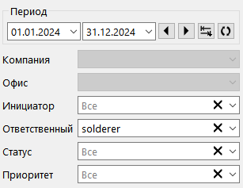

> Примечание: фильтрация заявок по компании и офису пока не реализована и элементы выключены.

Создать заявку может любой пользователь, независимо от наличия права использовать Менеджер (например, из карточки ремонта), поэтому в выпадающем списке Инициатор перечислены все активные пользователи.

Список Ответственный отображается при наличии у пользователя права "Видеть все заявки на закупку" и также содержит никнеймы всех пользователей с той целью, чтобы фильтр работал даже в случае отзыва прав.

> В случае ошибки выбора ответственных, в АСЦ заявка может остаться без обработки, т. к. пользователи могут видеть только те, за которые они назначены ответственными.

По умолчанию в поле Ответственный выбран текущий пользователь.

### Статус

Если статус в списке не выбран (отображается "Все"; значение по умолчанию), то не будут отображаться Выполненные и Отменённые заявки. Чтобы их увидеть нужно выбрать соответствующее значение в выпадающем списке.

### Приоритет

Позволяет отфильтровать заявки по одному из приоритетов или отобразить все (по умолчанию).

> Отмена фильтра по полю производится щелчком по кнопке .

### 

### Группировка

В программе есть возможность группировки заявок по поставщику. Это сделано, например, для тех случаев, когда запрошенная запчасть нужна не срочно и её заказ можно отложить; за некоторый период могут быть созданы другие заявки и группировка позволит сэкономить на доставке. Другими словами, группировка по поставщику позволяет забыть списки в Excel как страшный сон.

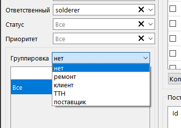

Также группировка по поставщику позволяет выбрать оптимальную цену товара если его можно купить у разных поставщиков (подробное описание механизма работы см. в разделе Таблица поставщиков и ссылок).

Режим группировки по клиенту будет удобен если вы часто привозите товары под заказ, а группировка по ТТН позволит передать выбранные заявки в таблицу на вкладке оприходования товара.

При выборе группы "Ремонт" будет отображен список ремонтов, для которых требуется заказ ЗИП; по смыслу это аналогично таблице заявок непосредственно в карточке ремонта, но позволяет быстрее ориентироваться.

### Текстовый

Поле для текстового поиска расположено аналогично всем вкладкам справа внизу. Фильтр работает по наименованию товара, именам поставщика и клиента и по URL. Список обновляется автоматически после ввода хотя бы одного символа после небольшой задержки.

## Таблица заявок

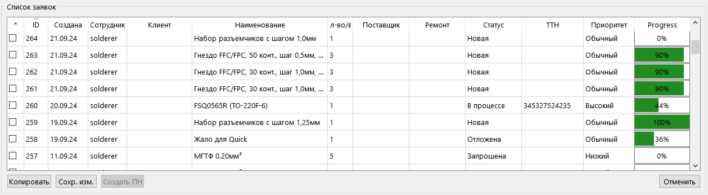

Верхняя половина основной рабочей области отведена для таблицы заявок. Таблица редактируемая и в ней можно изменить наименование товара, кол-во, статус, ТТН и приоритет заявки. Сохранение изменений выполняется вручную кнопкой "Сохр. изм.", и сопровождается уведомлением в правом нижнем углу экрана. Другие параметры редактируются  в карточке заявки (см. соотв. раздел справки).

> Примечание: при изменении настроек фильтра или при ручном обновлении списка и наличии не сохранённых изменений будет выведено предупреждение.

Изменить данные активной заявки (не находящейся в статусах Выполнена и Отменена) можно щелкнув по соответствующему полю таблицы левой кнопкой; в полях Наименование и ТТН курсор будет установлен в место щелчка.

В левом столбце отображаются CheckBox'ы  для быстрой передачи выбранных товаров на вкладку создания приходной накладной (функционал пока не реализован) нажатием кнопки "Создать ПН".

С помощью кнопки справа под таблицей можно быстро переключить статус в выделенных строках на "Отменена". Выделить строки можно щелчком по полю Клиент (или любому другому *не редактируемому* полю), а для выбора нескольких строк нужно использовать клавиши Shift и Ctrl.

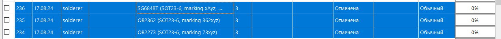

> Примечание: после установки статуса "Отменена" или "Выполнена" строка сразу становится не редактируемой. Т. е. отменить неправильно установленный статус можно только обновлением таблицы.

После нажатия кнопки "Сохр. изм." таблица будет обновлена и не активные заявки будут скрыты (см. раздел Фильтр - Статус).

Кнопка "Копировать" позволяет повторить заявку. Это удобно, например, при оформлении заявок на несколько разновидностей одного товара или при периодическом заказе запчастей. Кнопка работает только если выделена одна строка. После её нажатия будет открыта вкладка создания новой заявки и автоматически заполнены данные.

> Внимание: при копировании заявки список ответственных сотрудников будет так же скопирован.

Также процедура предусматривает копирование ссылок; если они были, отобразится диалоговое окно.

## Таблица поставщиков и ссылок

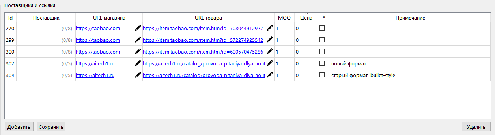

Для возможности агрегации заявок по поставщику с учетом стоимости предусмотрена таблица ссылок. Данные таблицы загружаются при одинарном щелчке по заявке.

> Примечание: таблица также отображается в карточке заявки, которая открывается двойным щелчком.

Столбцы "Поставщик" и "URL поставщика" нужны для режима группировки заявок. В первом столбце отображается наименование поставщика из списка клиентов, задать который можно только в карточке заявки (см. соотв. раздел). Во втором — ссылка на сайт поставщика или любой другой идентификатор поставщика; задать или изменить её можно непосредственно в таблице.

> Примечание: указывать данные в обоих полях не нужно.

В столбце "URL товара" может быть указана прямая ссылка на страничку товара и позволит быстро добавить его в корзину на тех площадках, где корзина не сохраняется.

> Примечание: в полях не обязательно указывать ссылку, можно записать произвольный текст

Непосредственно ссылки будут отображаться синим шрифтом с подчеркиванием и при щелчке будет открыт браузер. Редактирование в таких ячейках возможно при нажатии на значок карандаша. Если же записан произвольный текст, то редактирование производится щелчком по тексту, а курсор устанавливается в место щелчка.

В столбце "MOQ" указывается минимально возможное кол-во для заказа (англ. minimum order quantity), а в столбце "Цена" цена за единицу. Впрочем, каких-либо строгих требований к этим полям не предъявляется, и вы можете записывать туда любые числа.

Следующий столбец содержит CheckBox'ы. Это признак итогового выбора поставщика и используется в режиме группировки по поставщику, а также позволит просмотреть у какого именно продавца куплен товар в случаях покупки на маркетплейсе. CheckBox'ы работают по принципу переключателя.

В столбце примечаний может быть записана любая информация, касающаяся конкретного поставщика или товара по ссылке.

В режиме группировки по поставщику во втором столбце отображается два числа через дробь. Это подсказка об общем количестве заявок (знаменатель) и количестве выбранных заявок у этого поставщика (числитель). Число в знаменателе  соответствует числу в столбце "Заявок" в списке группировки.

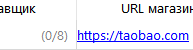            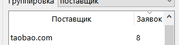       

Значение в числителе подсчитывается по отмеченным галочкой ссылкам в соответствующем столбце.

Подсказка помогает принять итоговое решение без просмотра списка групп; если он достаточно большой и поставщики расположены на большом расстоянии, подсказка упрощает процесс.

###### Как работает группировка по поставщику.

Предположим, нам требуется флюс для пайки BGA. Его продают поставщики А, Б и В и цены у них чуть-чуть отличаются. Создаём заявку и в таблицу ссылок добавляем всех трёх.

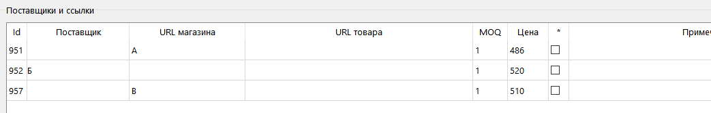

Чуть позже нам потребовались шарики BGA. Этот товар продают поставщики А, В и Г. Как и с флюсом, создаём заявку и добавляем ссылки.

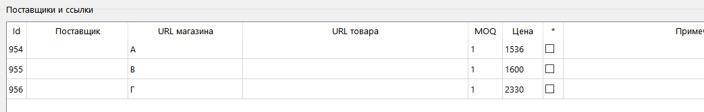

Теперь при включении режима группировки в списке групп будут отображены все: А, Б, В и Г. Для поставщиков А и В в столбце "Заявок" будет число 2, т. к. у них мы можем купить и флюс, и шарики, а для поставщиков Б и Г значение в этом столбце будет равно единице.

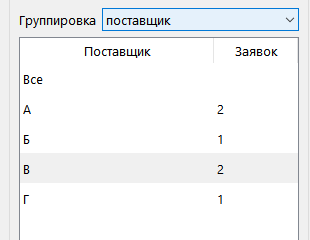

Одновременно с этим в таблице ссылок появятся подсказки с общим числом заявок. Для поставщиков А и В будет подсказка "(0/2)", а для Б и Г соответственно "(0/1)".

> Примечание: поставщик Б в списке ссылок для закупки флюса является постоянным и выбран из списка клиентов, но на отображение в списке групп это не влияет.

Принимаем решение купить флюс у поставщика А, т. к. его цена самая привлекательная, отмечаем ссылку  (CheckBox) и сохраняем список. Подсказка примет вид "(1/2)" и будет означать, что у этого поставщика выбран один товар.

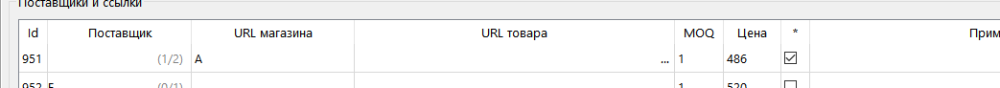

Такая же подсказка будет отображаться, когда мы загрузим список ссылок для заявки на закупку шариков BGA.

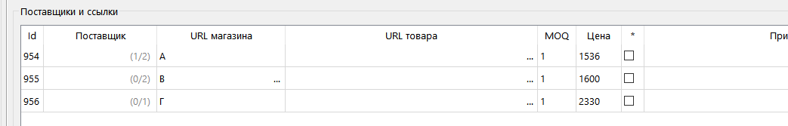

Также отмечаем ссылку поставщика А, поскольку и в этом случае его предложение наиболее выгодное, и сохраняем список. Подсказка примет вид "(2/2)".

# 

# Карточка заявки

## Новая заявка

Вкладка создания новой заявки открывается при нажатии кнопки Создать в Менеджере.

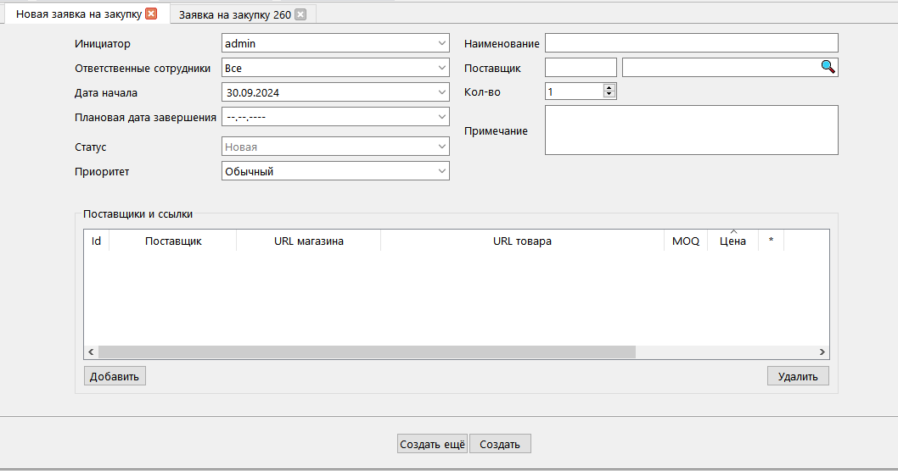

**Инициатор** (составитель): автоматически выбирается текущий пользователь, поле не редактируемое.

В поле **Ответственные сотрудники** необходимо отметить пользователей, которые могут видеть эту заявку и смогут её обработать. Кроме того, если включена отправка уведомлений эти сотрудники его получат. Список состоит из пользователей, которым на данный момент предоставлено право Использовать менеджер закупок. По умолчанию выбраны все. Ответственных можно изменить позже при редактировании заявки. Для создания заявки должен быть отмечен минимум один пользователь в противном случае поле будет подсвечено.

**Дата начала** по умолчанию равна текущей, но может быть выбрана будущая для отложенных заявок. После создания заявки дату начала изменить будет нельзя.

**Плановая дата завершения** используется для расчета индикатора прогресса в таблице заявок в Менеджере и не обязательна для указания.

Поле **Статус** станет редактируемым после создания заявки.

Заявки бывают трёх **Приоритетов**: Низкий, Обычный, Высокий. По умолчанию выбрано значение Обычный.

**Наименование** является обязательным и при его отсутствии и попытке создания заявки поле будет подсвечено.

**Поставщик** используется для группировки заявок и не является обязательным. Может быть выбран на соответствующей вкладке или из таблицы совпадений. На вкладке, открываемой при нажатии 🔍, по умолчанию включена категория Поставщики. Таблица совпадений появится при вводе в поле с кнопкой минимум трёх символов и только если в категории Поставщики будут найдены совпадения.

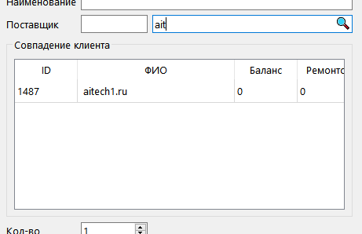

При выборе контрагента будет автоматически добавлена новая строка в таблицу ссылок, о которой речь пойдет ниже.

**Кол-во** Максимальное значение 99999.

**Примечание** не является обязательным.

**Поставщики и ссылки** почти ничем не отличается от таблицы в Менеджере.

> Примечание: таблица ссылок в Менеджере и в карточке заявки используют общий файл настроек. Сохранение происходит с задержкой в несколько секунд после изменения настроек или при закрытии вкладки.

Во-первых, только при создании или редактировании заявки можно указать название в столбце Поставщик.  Добавленная строка будет содержать имя, указанное в соответствующем поле вкладки. При добавлении других ссылок они также будут содержать имя поставщика, поэтому, если это не требуется, нужно очистить поля вкладки с помощью кнопки 🗙.

> Примечание: при группировке в списке поставщиков в первую очередь учитывается имя клиента из БД и только если клиент не задан используется значение поля "URL поставщика".

Во-вторых, сохранение списка ссылок происходит при создании заявки.

Для создания заявки наличие ссылок в таблице не обязательно. При группировке значения полей "Поставщик" и "URL поставщика" из таблицы учитываются наравне с полями вкладки. Таким образом, заявки, созданные в АСЦ, также будут отображаться в списке группировки.

При создании заявки из карточки ремонта на вкладке также будет отображаться поле **Ремонт** с его номером, а при создании заявки из карточки клиента (запчасть под заказ) поля **Клиент** с информацией о заказчике соответственно.

Кнопка **Создать** сохраняет введённые данные в БД, а вкладка переключается в режим редактирования заявки.

Кнопка **Создать ещё** предназначена для быстрого создания нескольких заявок подряд. После сохранения данных форма будет возвращена в первоначальное состояние за исключением полей с поставщиком.

После создания заявки список в Менеджере автоматически обновится, но только если не было произведено изменений в таблицах. При обновлении сохраняется положение прокрутки и/или выбранная группа в режиме группировки.

При закрытии вкладки проверяются поля Наименование, Примечание и таблица ссылок на наличие изменений. Проверка защищает от случайной потери данных.

## Редактирование заявки

Большая часть элементов та же, что и на вкладке создания новой заявки. Ниже описаны отличия.

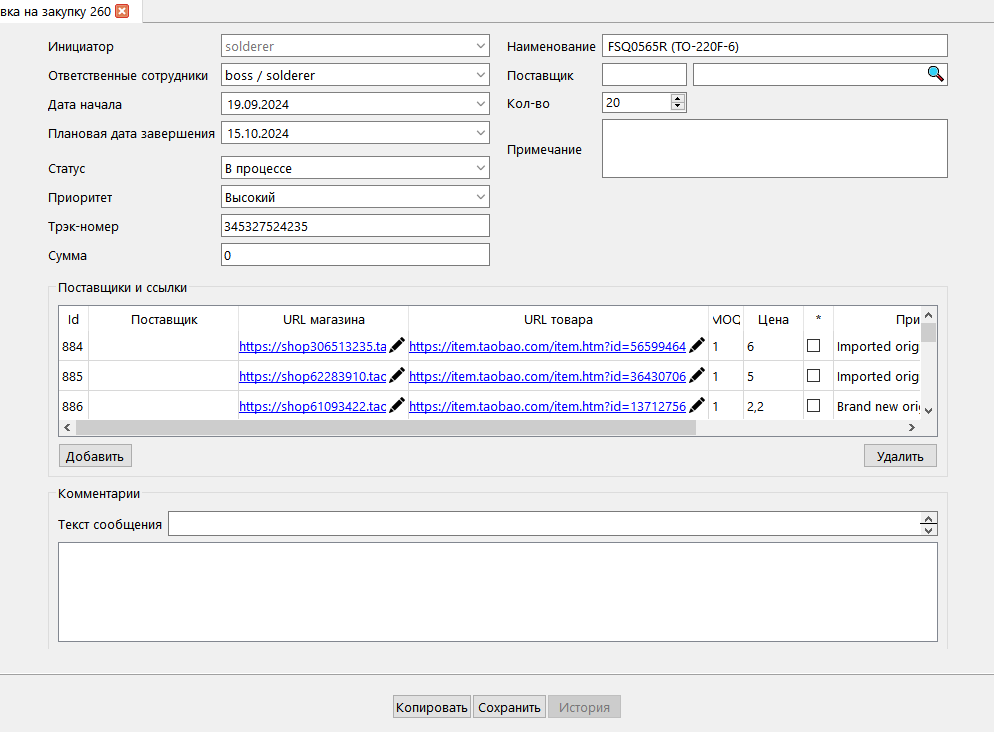

Изменение **ответственных сотрудников** влияет на уведомления если включена их отправка в основных настройках. В случае установки флагов в checkBox'ах всем новым пользователям будут отправлены уведомления. Соответственно, при снятии флагов ранее отправленные уведомления будут отозваны.

**Дату начала** не редактируемая.

**Статус** может быть изменён в любое время и на любой; последовательность переключения, как в ремонтах, не предусмотрена. В зависимости от статуса заявки изменяются состояния полей. В Выполненных и Отменённых заявках можно только оставлять **Комментарии**, все остальные поля не редактируемые. 

Поле **Трэк-номер** используется для группировки заявок в Менеджере и позволяет создать приходную накладную из заявок в отфильтрованном списке. А **Сумма** будет использована для расчета цены закупки.

Кнопка **Копировать** выполняет ту же функцию, что и одноимённая кнопка под таблицей заявок в Менеджере.

При закрытии вкладки проверяются все поля и таблица ссылок на наличие изменений. Проверка защищает от случайной потери данных.
